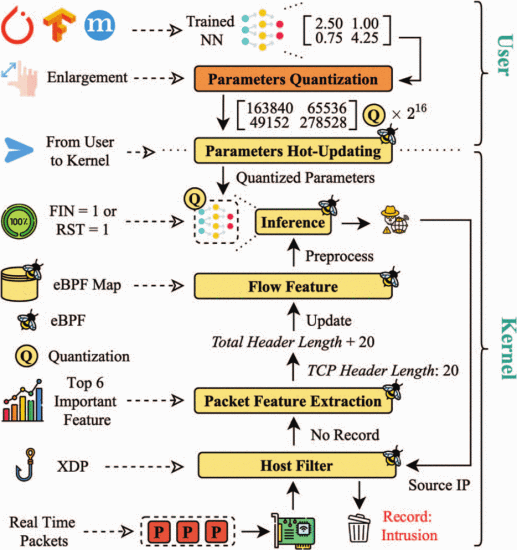

This project is cloned from `https://github.com/IntelligentDDS/NN-eBPF`.

# Introduction
This project is heavily inspired by [1], and aims to reproduce their work and test some new features with it.
It is included in a wider project that aims to create an IDS in a smartNIC with eBPF using XDP.

This readme is fully written by Sacha Corporeau, in english. There was a readme in initial commits but was deleted (I think because it was in chinese, and the authors does not want any chinese-written readme in their repo anymore).

# Project architecture

## `./bpftool` and `./libbpf`
are submodules imported with git submodules.

*Note that libbpf is included in bpftool, but the modules are still both loaded separately in our repo*

## `./src`
Contains all the C code (~kernel space) and python code (~user space) used to program the eBPF scripts shown in this picture :

More details provided in [1].

# References
[1] : Real-Time Intrusion Detection and Prevention with Neural Network in Kernel using eBPF, J. Zhang, P. Chen, Z. He, H. Chen, X. Li. 2024